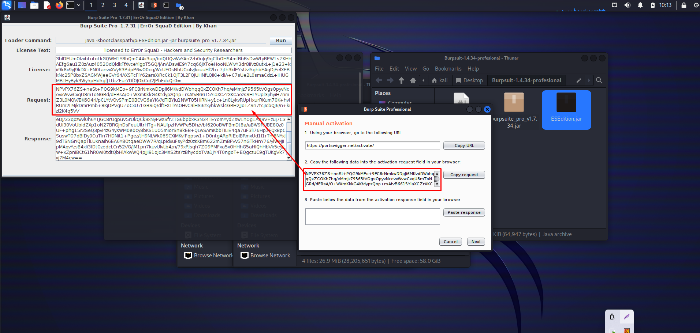

# Burp Suite Professional 1.4.34

<!-- contact me -->
<details open>
 <summary>&nbsp;Contact me ....</summary>
<div>
  <samp>
    <h2 align="center">you can reach me by:</h2>
    <p align="center">
      <br/>
      <a href="https://www.linkedin.com/in/aminul-islam-270816239/" target="blank"></a>
      <a href="https://www.facebook.com/aimehedi75" target="blank"></a>
      <a href="aminulislam0527@gmail.com" target="blank"></a>
    </p>
  <p align="center">
      <a href="https://www.instagram.com/ai_mehedi_hasan/" target="blank"></a>
     
     
  </samp>
</div>
</details>

## Burp Suite Professional Short Description

Burp Suite Professional is a powerful cybersecurity tool designed for web application security testing. It provides a range of functionalities, including scanning for security vulnerabilities, intercepting and modifying HTTP traffic, and various tools for manual testing of web applications.

## Installation Steps for Linux

### Java 8 Download and Install

1. **Download Java JDK 8:**
   - Visit [OpenLogic's OpenJDK Downloads](https://www.openlogic.com/openjdk-downloads) to download Java JDK 8.

2. **Install Java JDK 8:**
   ```bash
   sudo dpkg -i downloaded_file.deb
   ```

3. **Select Java 8 as the Default Version:**
   ```bash
   sudo update-alternatives --config java
   ```
   - Select the option corresponding to Java 8 from the list.
   - 

4. **Verify Java Version:**
   ```bash
   java -version
   ```

   Ensure that the installed Java version is Java 8.

### Burp Suite Professional Installation

1. **Run Burp Suite Professional:**
   ```bash
   java -noverify -jar ESEdition.jar
   ```

   Click on the "Run" button when prompted.

   
   
   
   
   
   
   

3. **Make the Script Executable:**
   ```bash
   sudo chmod +x burp.sh
   ```

4. **Open Burp Suite Professional:**
   ```bash
   ./burp.sh
   ```

   Burp Suite Professional is now ready to use.
